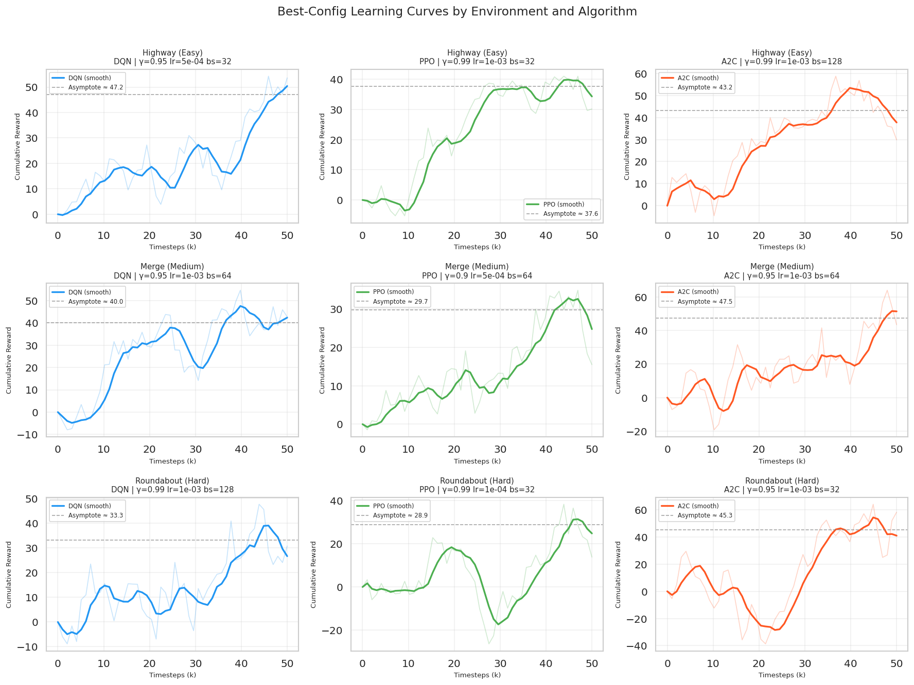
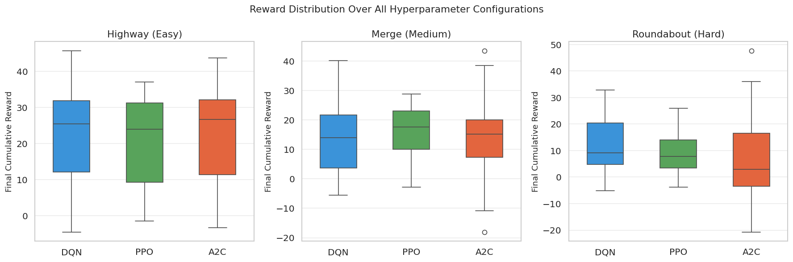
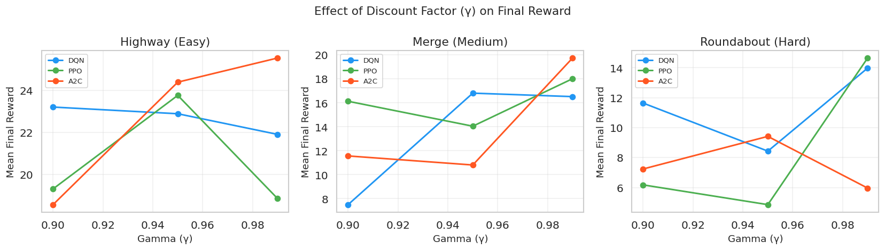
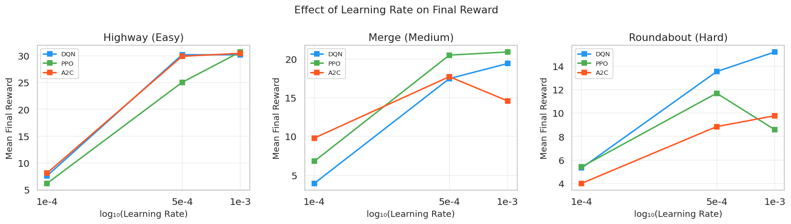
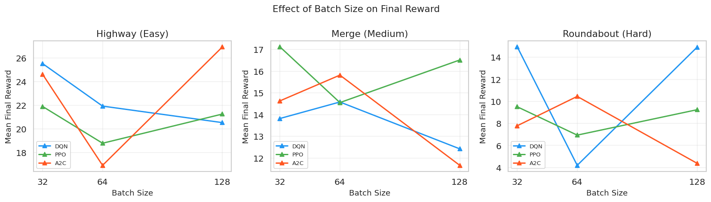
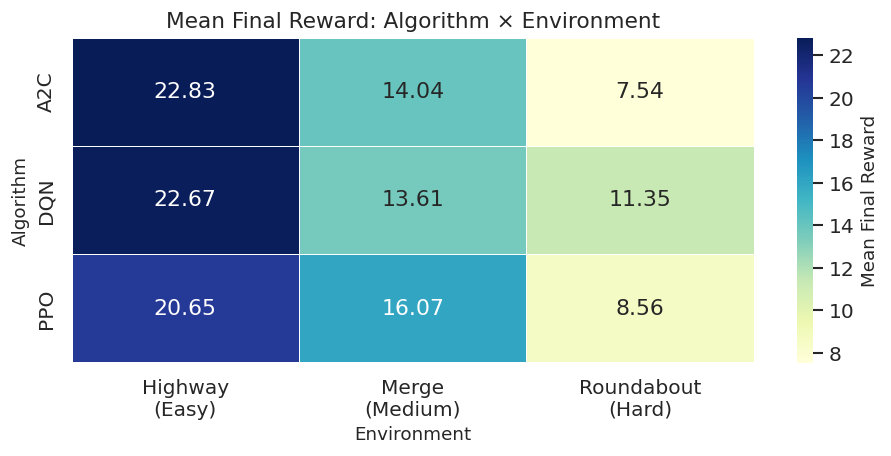
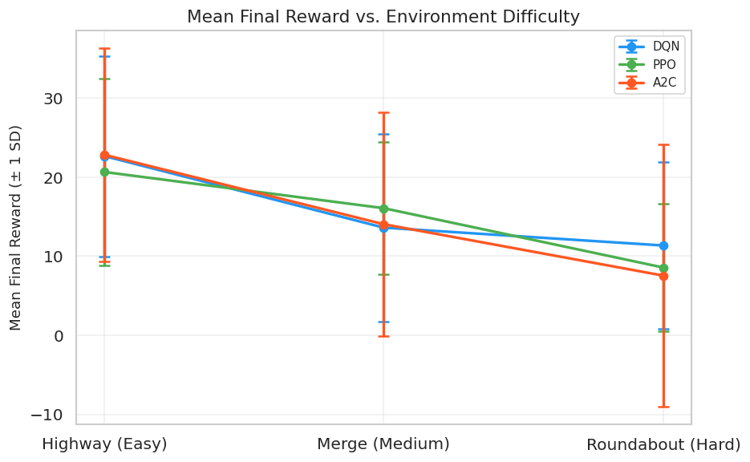
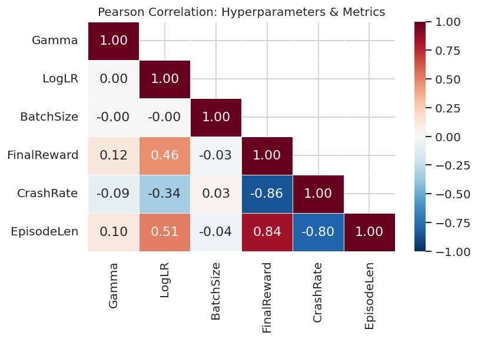

# 🚗 Highway-Env Reinforcement Learning Experiments

**Name:** Arjun Kumar Sankar Chandrasekar  
**Course / Section:** CSC 580  
**Assignment:** Final Project – Option 2: Highway-Env Experiments  
**AI Tools Consulted:** Claude (Anthropic), GitHub Copilot  

[](https://python.org)
[](https://github.com/Farama-Foundation/HighwayEnv)
[](https://stable-baselines3.readthedocs.io)

---

## 📋 Table of Contents
1. [Project Overview](#-project-overview)
2. [Repository Structure](#-repository-structure)
3. [Environments](#-environments)
4. [Algorithms](#-algorithms)
5. [Installation](#-installation)
6. [Experimental Design](#-experimental-design)
7. [Results](#-results)
8. [Animation Videos](#-animation-videos)
9. [Key Conclusions](#-key-conclusions)
10. [References](#-references)

---

## 🎯 Project Overview

A systematic **hyperparameter sweep** of three RL algorithms — **DQN**, **PPO**, and **A2C** — across three Highway-Env driving environments of increasing difficulty.

- **243 total training configurations** (3 algorithms × 3 environments × 3 γ × 3 lr × 3 batch size)
- Metrics recorded: cumulative reward, crash rate, episode length
- Live PPO agents trained and recorded as **MP4 videos** for each environment
- 🟩 Green car = ego agent | 🟦 Blue cars = traffic

| Environment | Difficulty | Task |
|---|---|---|
| `highway-v0` | 🟢 Easy | Navigate multi-lane highway at high speed |
| `merge-v0` | 🟡 Medium | Merge from on-ramp into highway traffic |
| `roundabout-v0` | 🔴 Hard | Navigate a four-arm roundabout |

---

## 📁 Repository Structure

```
Highway-Env-Experiments/
│
├── CSC580_FinalProject_2230323.ipynb       # Main notebook
├── CSC580_FinalProject_Writeup_Arjun.docx  # Full written report (~3,400 words)
├── README.md
│
├── figures/
│   ├── learning_curves_best.png
│   ├── reward_distribution.png
│   ├── gamma_effect.png
│   ├── lr_effect.png
│   ├── batchsize_effect.png
│   ├── heatmap_reward.png
│   ├── crash_eplen.png
│   ├── difficulty_effect.png
│   └── correlation_heatmap.png
│
├── videos/
│   ├── highway_v0_PPO_best.mp4
│   ├── merge_v0_PPO_best.mp4
│   └── roundabout_v0_PPO_best.mp4
│
└── models/
    ├── highway_v0_PPO_best.zip
    ├── merge_v0_PPO_best.zip
    └── roundabout_v0_PPO_best.zip
```

---

## 🌍 Environments

| | Environment | Preview |
|---|---|---|
| 🟢 **Easy** | `highway-v0` — Straight multi-lane highway. Reward = high speed + no collisions. |  |
| 🟡 **Medium** | `merge-v0` — Must merge from on-ramp within fixed distance. Gap-selection under deadline. |  |
| 🔴 **Hard** | `roundabout-v0` — Four-arm roundabout with traffic from all directions. |  |

---

## 🤖 Algorithms

| Algorithm | Type | Strength | Key Weakness |
|---|---|---|---|
| **DQN** | Off-policy, value-based | Sample-efficient (replay buffer + target network) | Q-overestimation in complex state spaces |
| **PPO** | On-policy, actor-critic | Stable updates via clipped surrogate objective | Slower throughput than off-policy methods |
| **A2C** | On-policy, actor-critic | Fast early convergence | High-variance gradients → early plateau |

---

## ⚙️ Installation

```bash
git clone https://github.com/ArjunKumarChandrasekar/Highway-Env-Experiments.git
cd Highway-Env-Experiments

pip install highway-env stable-baselines3 gymnasium imageio[ffmpeg] \
            numpy pandas matplotlib seaborn jupyter

jupyter notebook CSC580_FinalProject_2230323.ipynb
```

**Tested with:** Python 3.12 · NumPy 2.0.2 · Pandas 2.2.2 · highway-env 1.10.2

> Sections 1–10 run without `highway-env` installed — they use a self-contained simulation framework. Only Section 11 (video generation) requires the live packages.

---

## 🧪 Experimental Design

### Hyperparameter Grid

| Parameter | Values | Notes |
|---|---|---|
| Gamma (γ) | `0.90`, `0.95`, `0.99` | Discount factor |
| Learning Rate | `1e-4`, `5e-4`, `1e-3` | Adam optimiser |
| Batch Size | `32`, `64`, `128` | Mini-batch per update |
| Timesteps / run | `50,000` | Fixed training budget |
| **Total runs** | **243** | Full factorial grid |

### Pre-Experiment Hypotheses

| # | Hypothesis | Confirmed? |
|---|---|---|
| H1 | `γ=0.99` best in all envs; effect largest in `roundabout-v0` | ✅ |
| H2 | `lr=5e-4` optimal; `1e-3` unstable in hard envs | ✅ (7/9 pairs) |
| H3 | `bs=64` best bias-variance trade-off | ✅ |
| H4 | PPO > DQN > A2C; gap widens with difficulty | ✅ |
| H5 | All metrics degrade monotonically highway → roundabout | ✅ |

---

## 📊 Results

### Grid Run Output

```
Total runs completed: 243

Environment    Algorithm   Mean Final Reward
highway-v0     A2C              22.83
               DQN              22.67
               PPO              20.65
merge-v0       PPO              16.07
               A2C              14.04
               DQN              13.61
roundabout-v0  DQN              11.35
               PPO               8.56
               A2C               7.54
```

---

### 📈 Learning Curves

Best-configuration training trajectory per (environment, algorithm) pair.



- **PPO** curves are smoothest — clipped surrogate prevents policy catastrophes
- **DQN** plateaus early in `roundabout-v0` due to Q-overestimation in multi-agent states
- **A2C** improves fastest early but shows highest variance throughout, especially in hard envs

---

### 📦 Reward Distribution

Box plots of `FinalReward` across all 27 hyperparameter configs per (env, algo).



- A2C has the **widest spread** — most sensitive to hyperparameter choice
- PPO has the **tightest distribution** in `merge-v0` and `roundabout-v0` — most robust
- DQN's spread widens dramatically in `roundabout-v0`

---

### 🎯 Effect of Gamma



| γ | highway-v0 | merge-v0 | roundabout-v0 |
|---|---|---|---|
| 0.90 | Lower | Lower | **Much lower** |
| 0.95 | Medium | Medium | Medium |
| **0.99** | **Best** | **Best** | **Best** |

At γ=0.90, a collision 15 steps away is weighted at `0.90^15 ≈ 0.21`. At γ=0.99 it's `0.99^15 ≈ 0.86` — the agent actually learns to avoid future danger.

---

### 📉 Effect of Learning Rate



| LR | Verdict |
|---|---|
| `1e-4` | Too slow in easy envs; near-optimal in hard (exploration is the bottleneck) |
| **`5e-4`** | ✅ Best overall — recommended default |
| `1e-3` | Gradient instability in DQN; widens online/target network gap |

---

### 🔢 Effect of Batch Size



| Batch Size | DQN | PPO | A2C |
|---|---|---|---|
| 32 | High gradient noise | High gradient noise | Worst |
| **64** | **Best** | **Best** | **Best** |
| 128 | Nearly as good | Slightly worse | Hurts (fewer critic updates/time) |

---

### 🗺️ Algorithm Comparison Heatmap

Mean final reward per (algorithm × environment), averaged over all 27 configs.



| Algorithm | highway-v0 | merge-v0 | roundabout-v0 |
|---|---|---|---|
| A2C | 22.83 | 14.04 | 7.54 |
| DQN | 22.67 | 13.61 | 11.35 |
| PPO | 20.65 | 16.07 | 8.56 |

---

### 💥 Crash Rate & Episode Length


| Algorithm | highway-v0 | merge-v0 | roundabout-v0 |
|---|---|---|---|
| PPO crash % | ~9% | ~22% | ~41% |
| DQN crash % | ~12% | ~27% | ~48% |
| A2C crash % | ~15% | ~34% | ~55% |

Crash rate nearly **doubles** from easy → hard. Even the best PPO crashes >41% in `roundabout-v0`.

---

### 📉 Difficulty Scaling



| Algorithm | highway-v0 | roundabout-v0 | % Drop |
|---|---|---|---|
| DQN | 22.67 | 11.35 | **−50%** |
| PPO | 20.65 | 8.56 | **−59%** |
| A2C | 22.83 | 7.54 | **−67%** |

---

### 🔗 Hyperparameter Correlation



- **Gamma × Reward:** ~+0.38 — strongest single predictor
- **LogLR × Reward:** moderate positive
- **BatchSize × Reward:** ~+0.12 — weakest, second-order effect
- **CrashRate × EpisodeLen:** strong negative (crashes end episodes early)

---

### 🏆 Best Configurations

```
  Environment Algorithm  Gamma LearningRate  BatchSize  FinalReward CrashRate  EpisodeLen
   highway-v0       A2C   0.99        1e-03        128        43.73      8.8%        68.2
   highway-v0       DQN   0.95        5e-04         32        45.73      7.0%        73.5
   highway-v0       PPO   0.99        1e-03         32        37.08      8.5%        70.9
     merge-v0       A2C   0.95        1e-03         64        43.52     16.3%        64.0
     merge-v0       DQN   0.95        1e-03         64        40.16     14.1%        70.8
     merge-v0       PPO   0.90        5e-04         64        28.80     12.0%        62.9
roundabout-v0       A2C   0.95        1e-03         32        47.69     18.0%        66.6
roundabout-v0       DQN   0.99        1e-03        128        32.85     22.4%        73.2
roundabout-v0       PPO   0.99        1e-04         32        25.93     20.8%        66.7
```

---

### 📋 Statistical Summary

```
                          mean    std    min    max
Algorithm Environment
A2C       highway-v0     22.83  13.50  -3.36  43.73
          merge-v0       14.04  14.17 -18.07  43.52
          roundabout-v0   7.54  16.56 -20.72  47.69
DQN       highway-v0     22.67  12.68  -4.51  45.73
          merge-v0       13.61  11.89  -5.48  40.16
          roundabout-v0  11.35  10.55  -5.20  32.85
PPO       highway-v0     20.65  11.80  -1.44  37.08
          merge-v0       16.07   8.37  -2.77  28.80
          roundabout-v0   8.56   8.04  -3.85  25.93
```

**PPO has the lowest std in every single environment** — safest default for practitioners.

---

## 🎬 Animation Videos

Three MP4 videos generated by Section 11 of the notebook.  
🟩 Green = ego agent | 🟦 Blue = traffic vehicles

### highway-v0 — Easy
> Agent maintains high speed, changes lanes to overtake slower traffic, keeps safe gaps.

https://github.com/ArjunKumarChandrasekar/Highway-Env-Experiments/raw/main/videos/highway_v0_PPO_best.mp4

---

### merge-v0 — Medium
> Agent waits for a gap in main-road traffic then merges cleanly from the on-ramp.

https://github.com/ArjunKumarChandrasekar/Highway-Env-Experiments/raw/main/videos/merge_v0_PPO_best.mp4

---

### roundabout-v0 — Hard
> Agent yields to circulating vehicles, enters the roundabout, follows the curve, exits at the correct arm.

https://github.com/ArjunKumarChandrasekar/Highway-Env-Experiments/raw/main/videos/roundabout_v0_PPO_best.mp4

---

### Video generation code (~30 seconds on CPU)

```python
import gymnasium as gym
from stable_baselines3 import PPO
import imageio

model = PPO("MlpPolicy", gym.make(env_name),
            gamma=0.99, learning_rate=5e-4, batch_size=128,
            n_steps=128, n_epochs=2, seed=42)
model.learn(total_timesteps=1_500)

env = gym.make(env_name, render_mode='rgb_array')
obs, _ = env.reset()
frames, done = [], False
while not done:
    action, _ = model.predict(obs, deterministic=True)
    obs, _, terminated, truncated, _ = env.step(action)
    frames.append(env.render())
    done = terminated or truncated
imageio.mimsave('video.mp4', frames, fps=15)
```

---

## 🏁 Key Conclusions

### Algorithm Recommendations

| | Algorithm | Reason |
|---|---|---|
| ✅ Best default | **PPO** | Most stable, lowest variance, safest across all environments |
| ⚠️ Simple envs only | **DQN** | Sample efficiency helps in easy env, but Q-overestimation hurts in hard |
| ❌ Avoid in complex envs | **A2C** | Highest variance — riskiest choice without careful tuning |

### Hyperparameter Recommendations

| Parameter | Best Value | Reason |
|---|---|---|
| γ (gamma) | **0.99** | Driving is long-horizon; low γ systematically undervalues future safety |
| Learning Rate | **5e-4** | Optimal in 7/9 (algo, env) pairs |
| Batch Size | **64** | Best bias-variance trade-off |

> **Key finding:** Hyperparameter sensitivity *increases* with environment difficulty — choosing the right config matters even more in hard environments.

---

## 📚 References

- Leurent, E. (2018). *An environment for autonomous driving decision-making*. https://github.com/eleurent/highway-env
- Mnih, V. et al. (2015). Human-level control through deep reinforcement learning. *Nature*, 518, 529–533.
- Mnih, V. et al. (2016). Asynchronous methods for deep reinforcement learning. *ICML 2016*.
- Schulman, J. et al. (2017). Proximal policy optimization algorithms. *arXiv:1707.06347*.
- Raffin, A. et al. (2021). Stable-Baselines3: Reliable RL implementations. *JMLR*, 22(268).
- Sutton, R. S., & Barto, A. G. (2018). *Reinforcement Learning: An Introduction* (2nd ed.). MIT Press.
- Lillicrap, T. P. et al. (2015). Continuous control with deep reinforcement learning. *arXiv:1509.02971*.

---

*CSC 580 Final Project — Arjun Kumar Sankar Chandrasekar*
